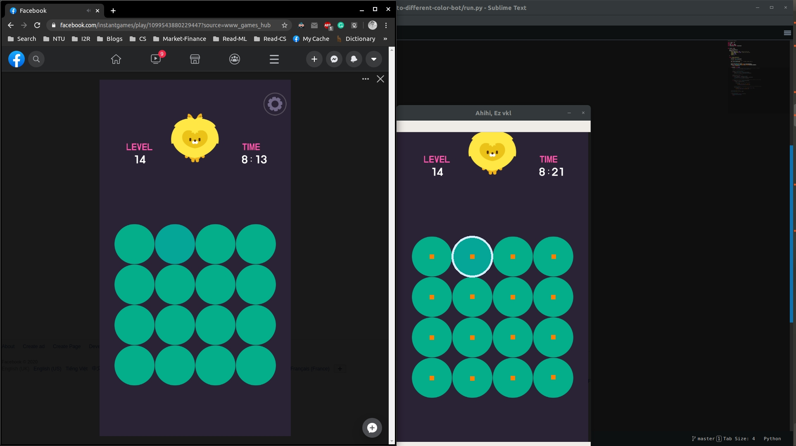

# Lyto bot
- Create a bot playing [Lyto DIFFERENT COLOR](https://www.facebook.com/instantgames/1099543880229447)

#### Demo

- [https://www.youtube.com/watch?v=rEbPOVu8Ho0](https://www.youtube.com/watch?v=rEbPOVu8Ho0)

#### Reference
- [Detect circles - OpenCV](https://www.pyimagesearch.com/2014/07/21/detecting-circles-images-using-opencv-hough-circles/)

#### TODO
- Autoclick feature
